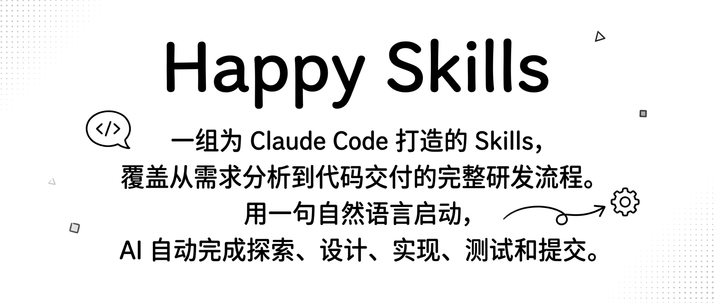

# Happy Skills

[中文](./README.md) | **English**

<p align="center">
  
</p>

A collection of Skills for [Claude Code](https://docs.anthropic.com/en/docs/claude-code) that cover the full development lifecycle — from requirements to shipped code. Describe what you need in plain language, and AI handles exploration, design, implementation, testing, and delivery.

## Installation

```bash
# Install all Skills
npx skills add notedit/happy-skills

# Install only what you need
npx skills add notedit/happy-skills --skills feature-dev,issue-flow

# Install globally (available in all projects)
npx skills add notedit/happy-skills -g
```

> Requires [skills CLI](https://www.npmjs.com/package/skills): `npm install -g skills`

## Quick Start

### From Issue to PR — One Command

```bash
/issue-flow #123                                      # Auto: read Issue → explore code → design plan → build team → implement → open PR
/issue-flow https://github.com/org/repo/issues/123    # URL format works too
/issue-flow                                           # No args? Pick from open Issues
```

### Design First, Then Build

```bash
# Step 1: Generate a design doc through interactive dialogue
/feature-analyzer user login with OAuth2 and WeChat QR code

# Step 2: Execute tasks from the design doc
/feature-pipeline docs/features/user-login.md
```

### Quick Development

```bash
/feature-dev add dark mode toggle to settings page
```

### Generate Tasks from Screenshots

```bash
/screenshot-analyzer ./competitor-app.png    # Analyze screenshot, extract features and dev tasks
```

## Skills

### Development (`skills/dev/`)

| Skill | Description |
|-------|-------------|
| `issue-flow` | Issue-driven development — from GitHub Issue to merged PR with automated planning, team coordination, and CI handling |
| `feature-dev` | Guided feature development — deep codebase understanding through explore → design → implement → test → review |
| `feature-analyzer` | Requirements analysis — turn rough ideas into structured design docs through interactive dialogue |
| `feature-pipeline` | Task execution engine — read design docs, implement step by step, supports resume from interruption |
| `screenshot-analyzer` | Screenshot analysis — extract features from UI screenshots and generate dev task checklists |

### Video & Animation (`skills/video/`)

| Skill | Description |
|-------|-------------|
| `video-producer` | Video production — natural language to complete Remotion video with narrative, orchestration, and rendering |
| `gsap-animation` | GSAP motion graphics — timeline orchestration, text splitting, SVG morphing |
| `spring-animation` | Spring physics — bouncy entrances, elastic trails, orchestrated sequences |
| `react-animation` | React effects — curated ReactBits visual effects for Remotion video production |

### Utilities (`skills/utils/`)

| Skill | Description |
|-------|-------------|
| `tts-skill` | Text-to-speech — MiniMax TTS API with voice cloning and voice design |
| `cover-image` | Cover image generation — auto-generate article cover images from content |
| `skill-creation-guide` | Skill creation guide — complete tutorial for building custom Skills |

## Project Structure

```
happy-skills/
├── package.json          # Package config & Skills registration
├── skills/
│   ├── dev/              # Development
│   ├── video/            # Video & animation
│   └── utils/            # Utilities
└── docs/                 # Documentation
```

## License

MIT
